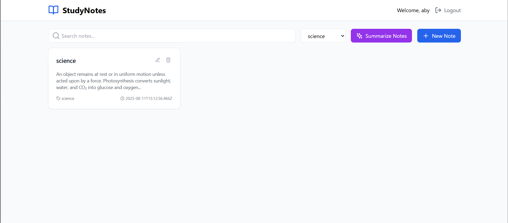
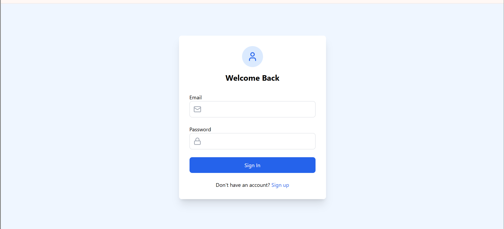
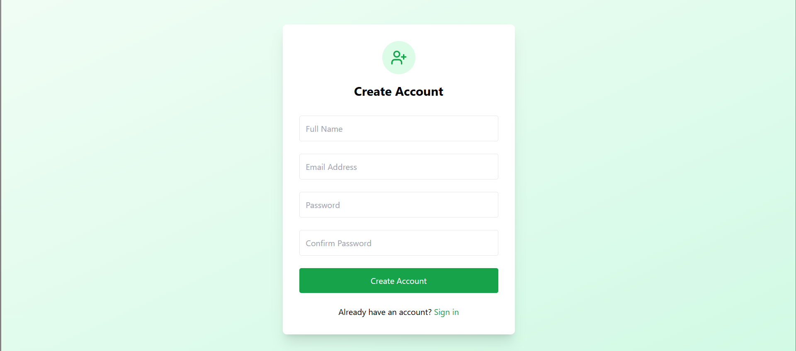
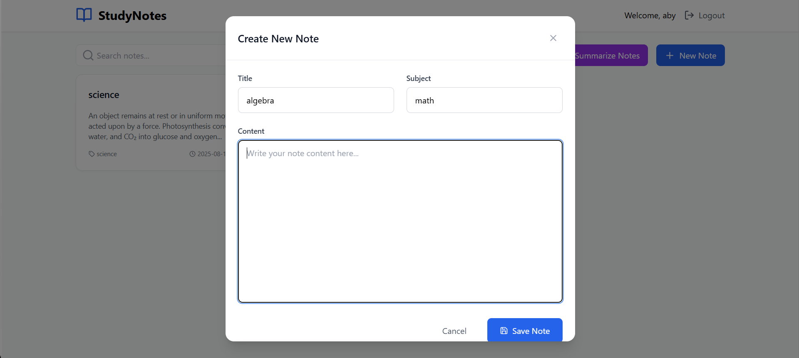

# NOTIVA

A full-stack MERN (MongoDB, Express, React, Node.js) application for managing student notes and tasks with secure authentication and a responsive interface. The project includes protected backend APIs, JWT-based user access, and independently deployed frontend and backend services.

---

## Screenshots

  
  
  


---

## Project Overview

This application enables users to create and manage personal notes and tasks with secure signup and login.  
The backend uses Node.js and Express with MongoDB Atlas for persistence, and the frontend uses React + Vite for a responsive UI.

Key points:

- JWT authentication and authorization  
- Protected CRUD endpoints for notes  
- RESTful API architecture  
- Responsive React frontend  
- Deployment ready (Render)

---

## Features

- Secure user authentication (JWT)  
- Create, read, update, delete notes  
- Responsive UI built with React  
- RESTful backend using Express and Mongoose  
- MongoDB Atlas as the database  
- Environment-based configuration  
- API calls using `fetch` with credential support  

---

## Tech Stack

**Frontend:** React, JavaScript, Vite, CSS  
**Backend:** Node.js, Express, JWT, Mongoose  
**Database:** MongoDB Atlas  
**Hosting:** Render  

---

## Deployment

**Backend:** https://mern-student-notes-app.onrender.com  
**Frontend:** https://mern-student-notes-app-1.onrender.com  

---

## Local Setup

### 1. Clone the repository

```bash
git clone https://github.com/abinaya-s-4/mern-student-notes-app
cd mern-student-notes-app
```

---

## Backend Setup

### 2. Navigate to the backend

```bash
cd server
```

### 3. Install dependencies

```bash
npm install
```

### 4. Create environment variables (backend)

Create a `.env` file inside the `server` folder:

```
MONGO_URI=your_mongodb_connection_string
JWT_SECRET=your_jwt_secret
FRONTEND_URL=http://localhost:5173  
PORT=5000
```

> Do not commit `.env` or real secrets to the repository.

### 5. Start the backend

```bash
npm start
```

Backend runs at:

```
http://localhost:5000
```

---

## Frontend Setup

### 6. Navigate to the frontend

```bash
cd ../client
```

### 7. Install dependencies

```bash
npm install
```

### 8. Create environment variables (frontend)

Create a `.env` file inside the `client` folder:

```
API_BASE_URL=http://localhost:5000
```

> Update the URL when deploying.

### 9. Start the frontend

```bash
npm run dev
```

Frontend runs at:

```
http://localhost:5173
```

---

## Redeployment Instructions

1. Push new changes to GitHub.  
2. Rebuild the backend on Render.  
3. Rebuild the frontend on Render.  
4. Verify environment variables.  
5. Update frontend API URL to the deployed backend URL.  

---

## Notes

- Never commit `.env` files.  
- Add `backend/.env` and `frontend/.env` to `.gitignore`.  
- MongoDB Atlas connection is required for backend functionality.

